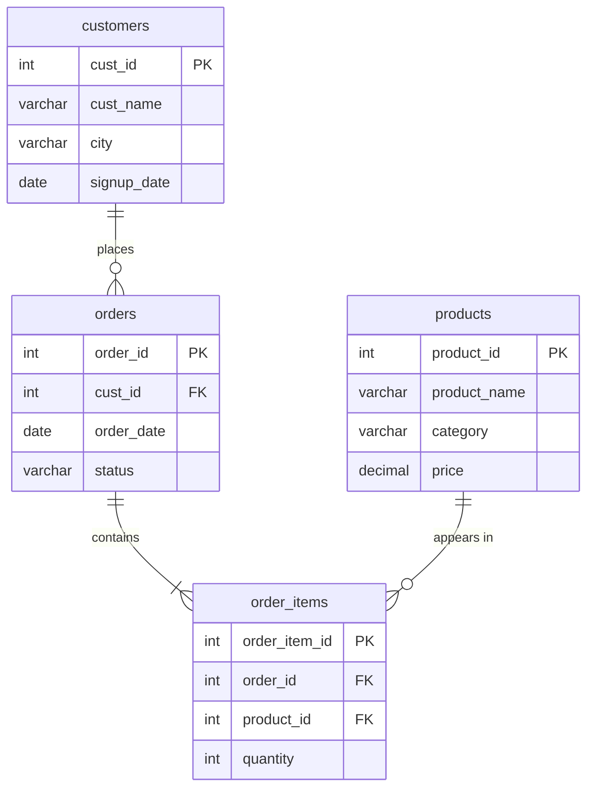

# E-Commerce Order Analysis (SQL)

A SQL analysis project on a small e-commerce database, answering 15 business questions about customers, orders, products and revenue. It combines multi-table joins, subqueries and set operations in MySQL.

## Business Questions Answered

| Section | Focus | Questions |
|---|---|---|
| A. Customer & Order Overview | Joins, aggregation | Order counts, spend per customer, delivered-order values, customers with no orders |
| B. Product & Category Insights | Joins, aggregation, tie-safe max | Revenue by product and category, best-selling product, distinct buyers per product |
| C. Subquery-Driven Analysis | Nested and correlated subqueries | Above-average spenders, top-revenue product, repeat customers, customers who never bought Furniture |
| D. Set Operations | UNION, EXISTS / NOT EXISTS | Combined city/category list, customers with Delivered but no Cancelled orders |
| E. Summary Report | Multi-table LEFT JOIN + multiple aggregates | One-row-per-customer report: orders, spend, latest order date |

## Database Schema



- **customers**: 6 rows (one customer, Singh Traders, has no orders on purpose to test edge cases)
- **products**: 6 rows across 3 categories (Electronics, Furniture, Stationery)
- **orders**: 10 rows with statuses Delivered, Pending and Cancelled
- **order_items**: 14 line items linking orders to products

All data is synthetic.

## Repository Structure

```
├── README.md      Project overview (this file)
├── schema.sql     Database and table definitions
├── data.sql       Sample data inserts
└── queries.sql    The 15 analysis queries, numbered and commented
```

## How to Run

1. Run `schema.sql` to create the database and tables.
2. Run `data.sql` to load the sample data.
3. Run `queries.sql` (or individual queries) to reproduce the results.

Built and tested with MySQL / MariaDB.

## Sample Output

**Q15: Customer summary report**

| cust_name | city | total_orders | total_spend | recent_order_date |
|---|---|---|---|---|
| Delhi Mart | Delhi | 2 | 4897 | 2023-03-15 |
| Gupta Stores | Noida | 2 | 12399 | 2023-05-01 |
| Rahul Traders | Faridabad | 3 | 11248 | 2023-04-10 |
| Sharma & Co | Gurgaon | 2 | 11700 | 2023-05-12 |
| Singh Traders | Delhi | 0 | 0 | NULL |
| Verma Enterprises | Faridabad | 1 | 2400 | 2023-04-22 |

**Q6: Revenue by category**

| category | revenue |
|---|---|
| Electronics | 14794 |
| Furniture | 24400 |
| Stationery | 3450 |

**Q14: Customers with a Delivered order and no Cancelled orders**

Rahul Traders, Sharma & Co

## SQL Concepts Demonstrated

- **Joins**: INNER and LEFT joins across up to four tables, with the anchor table chosen so that customers or products with no matching rows still appear
- **Aggregation**: `SUM`, `COUNT`, `COUNT(DISTINCT ...)`, `MAX`, `AVG` with `GROUP BY` and `HAVING`, aggregating at the correct grain (per order, per customer, per product)
- **Subqueries**: `IN` subqueries, derived tables, and a tie-safe "find the maximum, then match every row equal to it" pattern
- **Correlated subqueries**: `EXISTS` and `NOT EXISTS`, used instead of `NOT IN` so NULL values can't silently break the result
- **Set operations**: `UNION` with literal label columns
- **NULL handling**: `COALESCE` for zero-order customers and unsold products

## Design Notes

- **Line-item fan-out**: joining `orders` to `order_items` repeats each order once per line item, so counting orders in the summary report uses `COUNT(DISTINCT order_id)`.
- **Anchor tables**: queries that must list every customer or every product start from `customers` or `products` and use `LEFT JOIN`, so rows with no matches are kept rather than dropped.
- **Average spend (Q9)** is calculated over customers who placed at least one order.

## Tools

MySQL / MariaDB, MySQL Workbench
